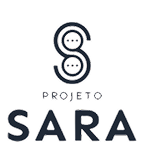

<!-- Improved compatibility of back to top link: See: https://github.com/othneildrew/Best-README-Template/pull/73 -->
<a id="readme-top"></a>
<!--
*** Thanks for checking out the Best-README-Template. If you have a suggestion
*** that would make this better, please fork the repo and create a pull request
*** or simply open an issue with the tag "enhancement".
*** Don't forget to give the project a star!
*** Thanks again! Now go create something AMAZING! :D
-->


<!-- PROJECT SHIELDS -->
<!--
*** I'm using markdown "reference style" links for readability.
*** Reference links are enclosed in brackets [ ] instead of parentheses ( ).
*** See the bottom of this document for the declaration of the reference variables
*** for contributors-url, forks-url, etc. This is an optional, concise syntax you may use.
*** https://www.markdownguide.org/basic-syntax/#reference-style-links
-->
<!--[![project_license][license-shield]][license-url] -->
[![Contributors][contributors-shield]][contributors-url]
[![Forks][forks-shield]][forks-url]
[![Stargazers][stars-shield]][stars-url]
[![Issues][issues-shield]][issues-url]
[![LinkedIn][linkedin-shield]][linkedin-url]


<!-- PROJECT LOGO -->
<br />
<div align="center">
  <a href="https://github.com/zauns/projeto-sara-frontend">
    
  </a>

<h3 align="center">Projeto SARA Emprega</h3>

  <p align="center">
    Vagas para mulheres em situação de vulnerabilidade social
    <br />
    <br />
    <a href="https://github.com/zauns/projeto-sara-frontend/issues/new?labels=bug&template=bug-report---.md">Reportar Bug</a>
    &middot;
    <a href="https://github.com/zauns/projeto-sara-frontend/issues/new?labels=enhancement&template=feature-request---.md">Requisitar Feature</a>
  </p>
</div>


<!-- TABLE OF CONTENTS -->
<details>
  <summary>Sumário</summary>
  <ol>
    <li>
      <a href="#about-the-project">Sobre o Projeto</a>
      <ul>
        <li><a href="#built-with">Feito Com</a></li>
      </ul>
    </li>
    <li>
      <a href="#getting-started">Rodando o Projeto</a>
      <ul>
        <li><a href="#prerequisites">Pré Requisitos</a></li>
        <li><a href="#installation">Installation</a></li>
      </ul>
    </li>
    <li><a href="#usage">Usage</a></li>
    <li><a href="#roadmap">Roadmap</a></li>
    <li><a href="#contributing">Contributing</a></li>
    <li><a href="#license">License</a></li>
    <li><a href="#contact">Contact</a></li>
    <li><a href="#acknowledgments">Acknowledgments</a></li>
  </ol>
</details>


<!-- ABOUT THE PROJECT -->
## Sobre o Projeto

O projeto consiste em um sistema de conexão de mulheres em situação de vulnerabilidade social a oportunidades de emprego e estágio. A iniciativa visa mitigar o desafio que muitas delas enfrentam para se reinserir no mercado de trabalho, o que compromete sua independência financeira e autoestima. Ao usar a tecnologia para criar essa ponte, a plataforma busca promover a inclusão, autonomia e o fortalecimento de vínculos profissionais.

<p align="right">(<a href="#readme-top">back to top</a>)</p>


### Feito Com

* [](#)
* 	[](#)
* [](#)
* [](#)


<p align="right">(<a href="#readme-top">back to top</a>)</p>


<!-- GETTING STARTED -->
## Rodando o Projeto (Front-end Isolado)

Siga os passos abaixo para configurar e executar o projeto localmente em ambiente de desenvolvimento.

### Pré-Requisitos

Antes de começar, certifique-se de ter as seguintes ferramentas instaladas em seu sistema:

* **Node.js** (versão 20 ou superior)
  - Baixe em: [https://nodejs.org/](https://nodejs.org/)
  - Verifique a instalação:
    ```sh
    node --version
    ```

* **npm** (gerenciador de pacotes do Node.js)
  - Geralmente vem junto com o Node.js
  - Para atualizar para a versão mais recente:
    ```sh
    npm install npm@latest -g
    ```
  - Verifique a instalação:
    ```sh
    npm --version
    ```

* **Git** (para clonar o repositório)
  - Baixe em: [https://git-scm.com/](https://git-scm.com/)
  - Verifique a instalação:
    ```sh
    git --version
    ```

### Instalação

1. **Clone o repositório**
   ```sh
   git clone https://github.com/zauns/projeto-sara-frontend.git
   ```

2. **Navegue até o diretório do projeto**
   ```sh
   cd projeto-sara-frontend
   ```

3. **Instale as dependências do projeto**
   ```sh
   npm install
   ```

4. **Configure as variáveis de ambiente**
   
   Crie um arquivo `.env.local` na raiz do projeto com as seguintes variáveis:
   ```env
   NEXT_PUBLIC_BACKEND_URL=http://localhost:8080
   ```
   
   > **Nota:** Ajuste a URL do backend conforme necessário. Se você estiver rodando o backend em outra porta ou endereço, atualize a variável `NEXT_PUBLIC_BACKEND_URL`.

5. **Execute o projeto em modo de desenvolvimento**
   ```sh
   npm run dev
   ```

6. **Acesse a aplicação**
   
   Abra seu navegador e acesse: [http://localhost:3000](http://localhost:3000)

### Comandos Úteis

Além do comando de desenvolvimento, o projeto possui outros scripts úteis:

* **Desenvolvimento** - Inicia o servidor de desenvolvimento com hot reload:
  ```sh
  npm run dev
  ```

* **Build de Produção** - Cria uma versão otimizada para produção:
  ```sh
  npm run build
  ```

* **Iniciar em Produção** - Executa a versão de produção (requer build prévio):
  ```sh
  npm start
  ```

* **Lint** - Verifica o código em busca de problemas:
  ```sh
  npm run lint
  ```

* **Limpeza e Desenvolvimento** - Remove cache e inicia o servidor:
  ```sh
  npm run clean-dev
  ```

### Estrutura de Pastas Principal

```
projeto-sara-frontend/
├── src/
│   ├── app/              # Páginas e rotas do Next.js
│   ├── components/       # Componentes React reutilizáveis
│   ├── contexts/         # Context API do React
│   ├── services/         # Serviços de API
│   ├── utils/            # Funções utilitárias
│   └── types/            # Tipos TypeScript
├── public/               # Arquivos estáticos
└── package.json          # Dependências e scripts
```

<p align="right">(<a href="#readme-top">back to top</a>)</p>


<!-- USAGE EXAMPLES 
## Usage

Use this space to show useful examples of how a project can be used. Additional screenshots, code examples and demos work well in this space. You may also link to more resources.

_For more examples, please refer to the [Documentation](https://example.com)_

<p align="right">(<a href="#readme-top">back to top</a>)</p>


<!-- ROADMAP 
## Roadmap

- [ ] Feature 1
- [ ] Feature 2
- [ ] Feature 3
    - [ ] Nested Feature

See the [open issues](https://github.com/zauns/projeto-sara-frontend/issues) for a full list of proposed features (and known issues).

<p align="right">(<a href="#readme-top">back to top</a>)</p>


<!-- CONTRIBUTING -->
## Contribuindo

Contribuições são o que tornam a comunidade open source um lugar incrível para aprender, inspirar e criar. Quaisquer contribuições que você fizer serão **muito apreciadas**.

Se você tem uma sugestão que tornaria isso melhor, por favor, faça um fork do repositório e crie um pull request. Você também pode simplesmente abrir uma issue com a tag "enhancement".
Não se esqueça de dar uma estrela ao projeto! Obrigado novamente!

1. Faça um Fork do Projeto
2. Crie sua Branch de Recurso (`git checkout -b feature/AmazingFeature`)
3. Faça Commit das Suas Alterações (`git commit -m 'Adicione algum Recurso Incrível'`)
4. Envie para a Branch (`git push origin feature/AmazingFeature`)
5. Abra um Pull Request

<p align="right">(<a href="#readme-top">voltar ao topo</a>)</p>

### Principais contribuidores:

<a href="https://github.com/zauns/projeto-sara-frontend/graphs/contributors">
  
</a>


<!-- LICENSE
## License

Distributed under the project_license. See `LICENSE.txt` for more information.

<p align="right">(<a href="#readme-top">back to top</a>)</p>


<!-- CONTACT -->
## Contact

João Ricardo - joaobarbosa226@gmail.com

Project Link: [https://github.com/zauns/projeto-sara-frontend](https://github.com/zauns/projeto-sara-frontend)

<p align="right">(<a href="#readme-top">back to top</a>)</p>


<!-- ACKNOWLEDGMENTS 
## Reconhecimentos

* []()
* []()
* []()

<p align="right">(<a href="#readme-top">back to top</a>)</p>


<!-- MARKDOWN LINKS & IMAGES -->
<!-- https://www.markdownguide.org/basic-syntax/#reference-style-links -->
[contributors-shield]: https://img.shields.io/github/contributors/zauns/projeto-sara-frontend.svg?style=for-the-badge
[contributors-url]: https://github.com/zauns/projeto-sara-frontend/graphs/contributors
[forks-shield]: https://img.shields.io/github/forks/zauns/projeto-sara-frontend.svg?style=for-the-badge
[forks-url]: https://github.com/zauns/projeto-sara-frontend/network/members
[stars-shield]: https://img.shields.io/github/stars/zauns/projeto-sara-frontend.svg?style=for-the-badge
[stars-url]: https://github.com/zauns/projeto-sara-frontend/stargazers
[issues-shield]: https://img.shields.io/github/issues/zauns/projeto-sara-frontend.svg?style=for-the-badge
[issues-url]: https://github.com/zauns/projeto-sara-frontend/issues
[license-shield]: https://img.shields.io/github/license/zauns/projeto-sara-frontend.svg?style=for-the-badge
[license-url]: https://github.com/zauns/projeto-sara-frontend/blob/master/LICENSE.txt
[linkedin-shield]: https://img.shields.io/badge/-LinkedIn-black.svg?style=for-the-badge&logo=linkedin&colorB=555
[linkedin-url]: https://linkedin.com/in/jrzzzzz
[product-screenshot]: images/screenshot.png
<!-- Shields.io badges. You can a comprehensive list with many more badges at: https://github.com/inttter/md-badges -->
[Next.js]: https://img.shields.io/badge/next.js-000000?style=for-the-badge&logo=nextdotjs&logoColor=white
[Next-url]: https://nextjs.org/
[React.js]: https://img.shields.io/badge/React-20232A?style=for-the-badge&logo=react&logoColor=61DAFB
[React-url]: https://reactjs.org/
[Vue.js]: https://img.shields.io/badge/Vue.js-35495E?style=for-the-badge&logo=vuedotjs&logoColor=4FC08D
[Vue-url]: https://vuejs.org/
[Angular.io]: https://img.shields.io/badge/Angular-DD0031?style=for-the-badge&logo=angular&logoColor=white
[Angular-url]: https://angular.io/
[Svelte.dev]: https://img.shields.io/badge/Svelte-4A4A55?style=for-the-badge&logo=svelte&logoColor=FF3E00
[Svelte-url]: https://svelte.dev/
[Laravel.com]: https://img.shields.io/badge/Laravel-FF2D20?style=for-the-badge&logo=laravel&logoColor=white
[Laravel-url]: https://laravel.com
[Bootstrap.com]: https://img.shields.io/badge/Bootstrap-563D7C?style=for-the-badge&logo=bootstrap&logoColor=white
[Bootstrap-url]: https://getbootstrap.com
[JQuery.com]: https://img.shields.io/badge/jQuery-0769AD?style=for-the-badge&logo=jquery&logoColor=white
[JQuery-url]: https://jquery.com 